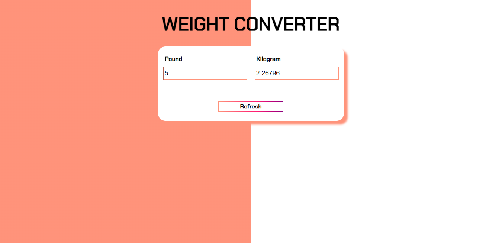

# WeightConverter

This is a Weight Converter solution that converts pounds (lbs) to kilograms (kg) and kilograms (kgs) to pounds (lbs). 

## Table of contents

- [Overview](#overview)
  - [Screenshot](#screenshot)
  - [Links](#links)
- [My process](#my-process)
  - [Built with](#built-with)
  - [What I learned](#what-i-learned)
  - [Continued development](#continued-development)
  - [Useful resources](#useful-resources)
- [Author](#author)

## Overview

### Screenshot

### Links

- Solution URL: [https://github.com/Makia98/WeightConverter](https://github.com/Makia98/WeightConverter)
- Live Site URL: [https://makia98.github.io/WeightConverter/](https://makia98.github.io/WeightConverter/)

## My process

### Built with

- Semantic HTML5 markup
- CSS custom properties
- Flexbox

### What I learned

I was able to experiment with the Javascript HTML DOM. I was also able to create custom functions for my measurement conversions.

### Continued development

I'd love to dive even further into customizing CSS, the JavaScript DOM.

### Useful resources

- [MDN](https://developer.mozilla.org/en-US/docs/Web/CSS/padding) - MDN is of course my go to resource for all things HTML and CSS. 
-[Outfit](https://fonts.google.com/specimen/Outfit) - Google Fonts was used and will be for many projects if not all.
-[JavascriptW3Schools](https://www.w3schools.com/js/default.asp)

## Author
- Frontend Mentor - [@Makia98](https://www.frontendmentor.io/profile/Makia98)
